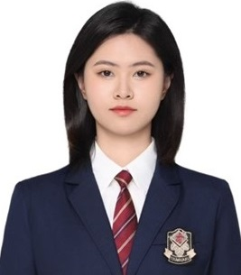
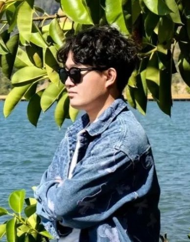
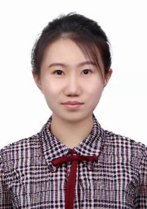

# Sichuan University
---
## Master
---
### In progress
* Le Yu
* Quansong He
* Yue Cao
* Jianlong Xiong

---
## Undergraduate
### In progress
* Xuran He
* Xingran Yu
* Tianqi Xu
* Yiming Zhao
* Yichen Yu
* Pengfei Ma
* Yashi Zhu
---

|**毕业时间** | 2024|2025 |2025|
|------------------|-------------------------------|----------------------|---------------------|
| **姓名**| 
刘雅琪
| 
王凯珅
 | 
崔力
 |
| **头像** | 

| 

|

 |
| **毕业去向**     | 香港中文大学（深圳）· 数据科学专业（硕士） | 美国马里兰大学 · 人工智能方向（直博）| 北京快手科技有限公司（工作）|
| **学术成果**     | **2025.01** 第一作者 ·  **SCI期刊 Computerized Medical Imaging and Graphics** **2023.10** 第一作者 · CSIS-IAC会议论文（EI）| **2024.04** 第一作者 · CCF-A类会议 **IJCAI** **2024.10** 第一作者 · **NeurIPS Workshop** **2025.01** 第一作者 · 机器学习顶会 **ICLR** | **2024.01** 第三作者  · **SCI期刊 Neurocompting**   **2025.10** 第一作者  · **SCI期刊 Neurocompting**|
| **核心荣誉**     |**2021.09** 四川大学单项一等奖学金   **2022.09** 四川大学综合三等奖学金   **2023.09** 四川大学综合三等奖学金   |**2022.09** 国家励志奖学金 **2023.09** 四川大学优秀学生 **2024.09** 国家励志奖学金（二次获评） **2022.05** 学院杯辩论赛总冠军  校/省/国家级竞赛奖项  **10+项** 校省级奖学金 **5+项**                   |**2023~2024** 两次获批校级大创项目|

